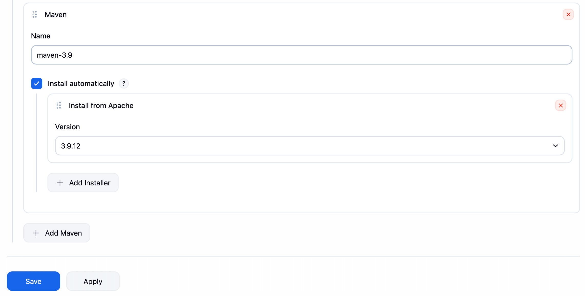
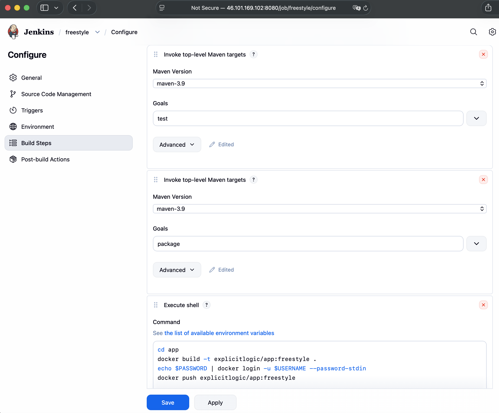
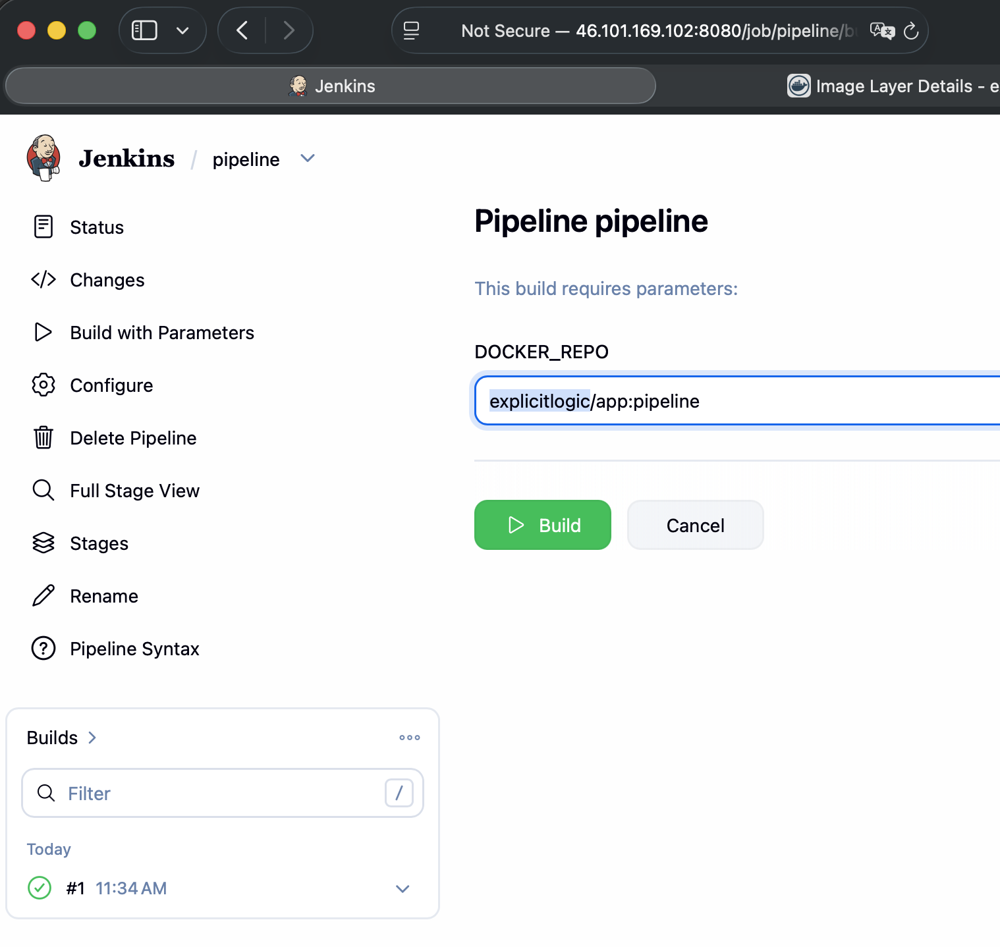

# Module 8 - Build Automation & CI/CD with Jenkins

This repository contains a demo project created as part of my **DevOps studies** in the **TechWorld with Nana – DevOps Bootcamp**.

https://www.techworld-with-nana.com/devops-bootcamp

***Demo Project:*** Create a CI Pipeline with Jenkinsfile (Freestyle, Pipeline, Multibranch Pipeline)

***Technologies used:*** Jenkins, Docker, Linux, Git, Java, Maven

***Project Description:*** 

CI Pipeline for a Java Maven application to build and push to the repository

- Install Build Tools (Maven, Node) in Jenkins
- Make Docker available on Jenkins server
- Create Jenkins credentials for a git repository
- Create different Jenkins job types (Freestyle, Pipeline, Multibranch pipeline) for the Java Maven project with Jenkinsfile to:
  - a. Connect to the application’s git repository
  - b. Build Jar
  - c. Build Docker Image
  - d. Push to private DockerHub repository

---

### Prerequisites

Install Jenkins on DigitalOcean (complete all the steps):

https://github.com/explicit-logic/jenkins-module-8.1

---

### Install Build Tools (Maven, Node) in Jenkins

1. Configure a plugin for Maven

Navigate to Manage Jenkins -> Tools -> Maven installations

Choose `Add Maven`

Name: `maven-3.9`

Click Save



2. Install npm and Node in Jenkins container

Enter a `docker` container as a `root` user


```sh
docker exec -u 0 -it <container_id> bash

apt update
apt install curl
```

The curl command used to install NodeJS on the Jenkins server is:

```sh
curl -sL https://deb.nodesource.com/setup_20.x -o nodesource_setup.sh

bash nodesource_setup.sh

apt install nodejs

node -v # to check NodeJS is installed
npm -v # to check npm is installed
```

3. Install `Stage view` plugin

- Navigate to Manage Jenkins -> Plugins -> Available plugins

- Find `Stage view` plugin and click Install

- Click "Restart jenkins when installation is complete and no jobs are running"


- Start Jenkins manually

```sh
docker ps -a
docker start <container_id>
```

- Navigate to installed plugins and check that plugin has been installed

### Make Docker available on Jenkins server

1. Stop existed Jenkins container

```sh
docker ps
docker stop <container_id>
```

2. Start a new Jenkins container

```sh
docker run -p 8080:8080 -p 5000:5000 -d \
-v jenkins_home:/var/jenkins_home \
-v /var/run/docker.sock:/var/run/docker.sock \
jenkins/jenkins:lts
```

3. Go inside the Jenkins container as `root` user
```sh
docker ps
docker exec -it -u 0 <container_id> bash
```

4. Execute docker installation

```sh
curl https://get.docker.com/ > dockerinstall && chmod 777 dockerinstall && ./dockerinstall
```

5. Provide permissions:
```sh
chmod 666 /var/run/docker.sock
```

6. Logout as root user from the container and log-in again as jenkins

```sh
exit
docker exec -it <container_id> bash
```

Try this to check the Docker works: `docker pull redis`

### Create Jenkins credentials for a git repository

1. Navigate to Manage Jenkins -> Credentials

2. Click `Add Credentials`

3. Select `Username with password`

Username: `<Your GitHub account username>`
Password: `<Your GitHub account password>`

Treat username as secret: Yes

ID: `github`

### Create a private docker repository

1. Navigate to `https://hub.docker.com/repositories/`

2. Create a repository

Name: `app`
Visibility: `Private`

### Create Jenkins credentials for a docker repository

1. Navigate to Manage Jenkins -> Credentials

2. Click `Add Credentials`

3. Select `Username with password`

Username: `<Your Docker account username>`
Password: `<Your Docker account password>`

Treat username as secret: Yes

ID: `docker`

### Create `Freestyle` Jenkins job

1. Go to the main page and click `Create a job`

Name: `freestyle`

Select an item type: `Freestyle project`

2. Source Code Management - Git

Repository URL: `https://github.com/explicit-logic/jenkins-module-8.2`

Credentials: `github`

Branches to build: `*/freestyle`

3. Environment -> Use secret text(s) or file(s) -> Add -> Username and Password (separated)

Username Variable: `USERNAME`
Password Variable: `PASSWORD`

Credentials: `docker`

4. Add a build step: `Invoke top-level Maven targets`

Maven Version: `maven-3.9`

Goals: `test`

POM: `app/pom.xml`

5. Add build step: `Invoke top-level Maven targets`

Maven Version: `maven-3.9`

Goals: `package`

POM: `app/pom.xml`

6. Add build step: `Execute Shell`

Command
```sh
cd app
docker build -t <docker username>/app:freestyle .
echo $PASSWORD | docker login -u $USERNAME --password-stdin
docker push <docker username>/app:freestyle
```



7. Run the job, click `Build Now`


### Create `Pipeline` Jenkins job

1. Go to the main page and click `New Item`

Name: `pipeline`

Select an item type: `Pipeline`

2. Scroll to `Pipeline` section

Definition: `Pipeline script from SCM`

SCM: `Git`

Repository URL: `https://github.com/explicit-logic/jenkins-module-8.2`

Credentials: `github`

Branches to build: `*/pipeline`

3. Run the job, click `Build with Parameters`

DOCKER_REPO: `<docker username>/app:pipeline`




